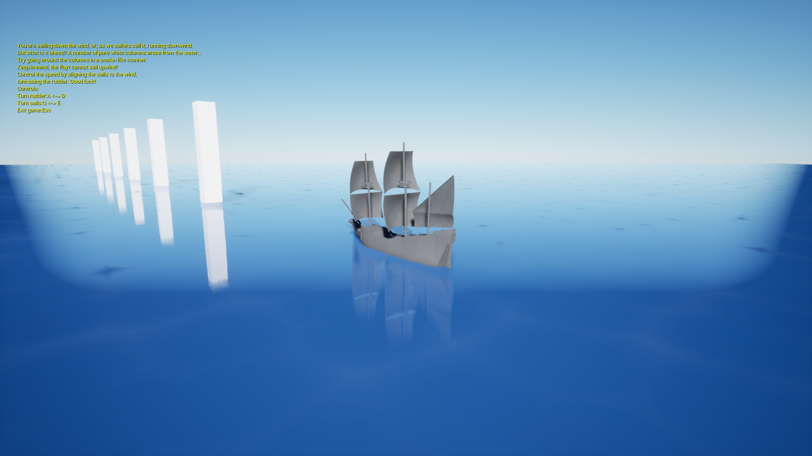

# UE4_ShipProject

A little educational project created while learning the basics of UE. For more info see the [PDF](./ShipProject.pdf).

## Executable

There is a launchable version build for Windows (64-bit) that can be found in the [EXE](./EXE/WindowsNoEditor) folder.

The controls are:
  - A and D to rotate the rudder (the hind flappy bit which helps the ship turn left and right)
  - Q and E to rotate the sails (the wind blows down in the direction of the columns, orienting the sails to catch more wind increases the speed)
  - Esc - exit game

